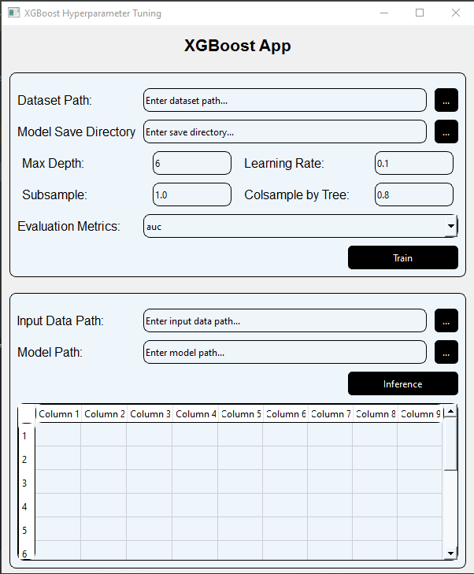

# XGBooster model trainer/inference App

This is the windows application that customizes xgbooster to your dataset and then train or run semlessly.

## Environment Setup.

> pip install -r requirements.txt

## Run the application.
> python main.py

## Just Enjoy!!!

  

